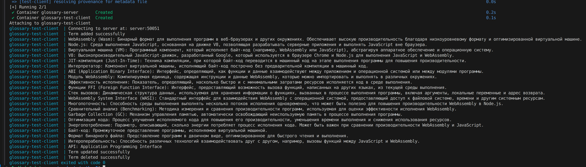

# Развёртывание

## Локальное развёртывание

### Pre-requisites

- make (Unix-builtin)
- python v3.x.x

### Шаги

- `make install` - устанавливаем зависимости
- `make generate-proto` - генерируем proto-обёртки
- `python server.py` - поднимаем сервер
- `python test_client.py` - запускаем тестовые команды

## Docker-развёртывание

### Pre-requisites

- Docker & Docker Compose
- make (Unix-builtin)
- python v3.x.x

### Шаги

- `make install` - устанавливаем зависимости
- `make generate-proto` - генерируем proto-обёртки
- `make build-image` - собираем образ
- `make compose-up` - поднимаем компоуз с контейнерами

>Вообще говоря, первые два шага должны быть сделаны в процессе сборки образа, но я не смог заставить
proto-обёртки сгенерироваться в образе по непонятной причине "glossary.proto: not found" (не понятно, почему not found)

# Результат

Поднимаем компоуз и видим output контейнера с тестовыми запусками команд

